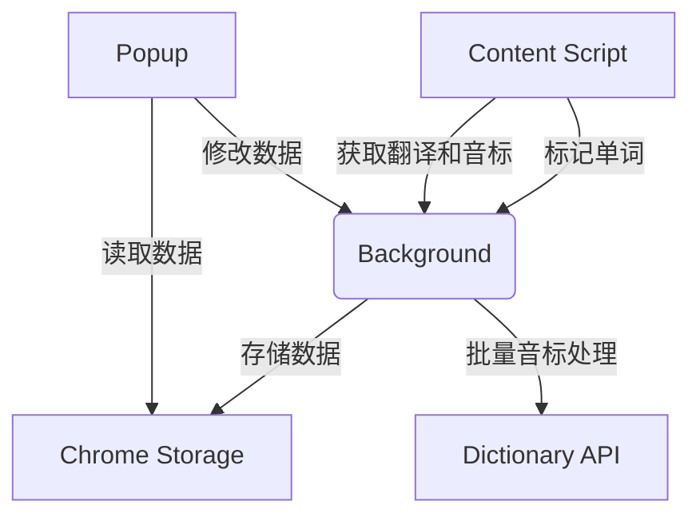

# Chrome 英语单词学习插件

## 功能概述
1. **单词标记与翻译**
   - 划选网页任意英文单词/词组自动添加蓝色下划线标记
   - 鼠标悬停标记显示翻译和音标
   - 自动保存到单词本

2. **单词本管理**
   - 查看所有已标记单词和词组
   - 编辑单词翻译和音标
   - 删除不需要的单词
   - 搜索单词功能
   - 自动记录添加/复习时间

3. **数据持久化**
   - 页面刷新后自动恢复标记
   - 所有数据本地存储，支持批量音标更新

## 使用说明

### 安装与加载
1. 在Chrome地址栏输入：`chrome://extensions/`
2. 启用"开发者模式"
3. 点击"加载已解压的扩展程序"
4. 选择插件目录

### 基本使用
1. **标记单词**：在任意网页划选英文单词/词组
2. **查看翻译**：鼠标悬停标记单词（显示音标）
3. **管理单词本**：点击浏览器工具栏插件图标
   - 搜索：输入框实时筛选
   - 编辑：点击单词卡片的✏️按钮（可更新音标）
   - 删除：点击单词卡片的🗑️按钮

### 音标功能
- 自动获取单词英式/美式音标
- 悬停时显示正确发音标注
- 支持手动更新音标信息

## 技术实现



### 核心文件
1. `manifest.json` - 插件配置（新增音标API权限）
2. `content.js` - 网页单词标记逻辑（支持词组和URL检测）
3. `background.js` - 核心业务逻辑与存储（新增批量音标处理）
4. `popup/` - 单词本界面

## 配置选项
可在`manifest.json`中修改：
- 默认图标
- API权限设置
- 扩展行为

## 开发者说明

### 测试数据
```javascript
// 测试翻译API返回格式
{
  word: "example",
  translation: "例子",
  phonetic: "/ɪɡˈzɑːmpl/",
  added: 1672531200000,
  reviewed: 0
}
```

### 替换翻译API
修改`background.js`中的`handleTranslation`方法

## 版权信息
© 2026 英语学习插件开发团队