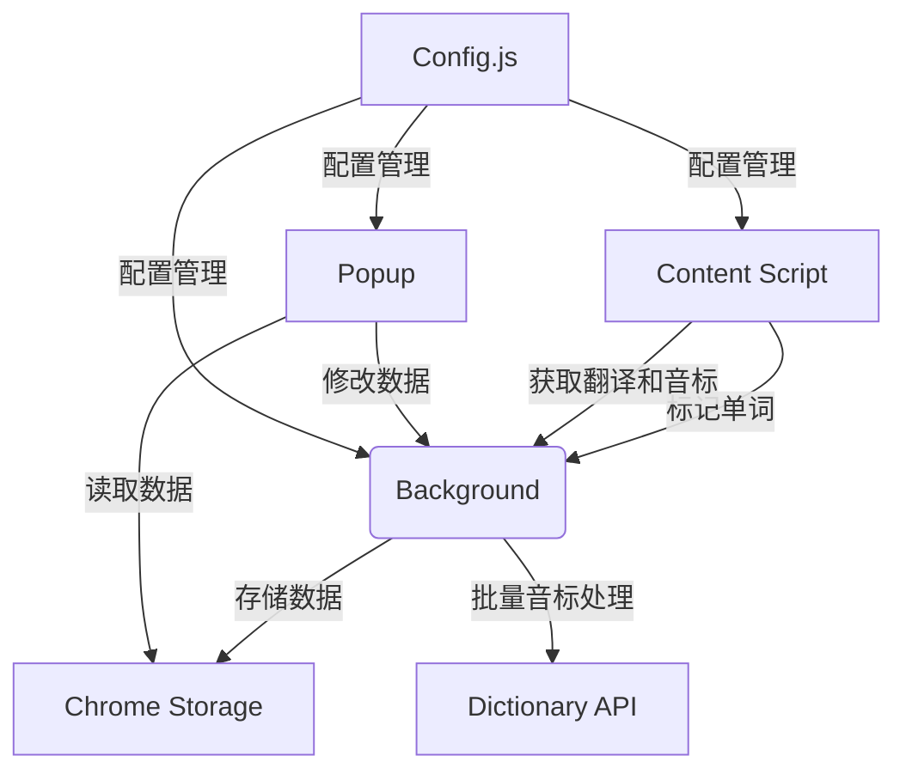

# Chrome 英语单词学习插件

## 功能概述
1. **智能单词标记**
   - 划选网页任意英文单词/词组自动添加蓝色下划线标记
   - 支持词组和多单词标记
   - 自动跳过前后空格
   - 300ms延迟确认机制，避免误操作
   - 支持ESC键取消标记

2. **实时翻译与音标**
   - 鼠标悬停标记显示现代化渐变弹窗
   - 先划线后翻译，提升用户体验
   - 显示"正在翻译..."临时提示
   - 自动获取单词音标和发音

3. **标记同步**
   - 标记一个单词，页面所有相同内容自动标记
   - 取消一个标记，页面所有相同标记自动移除
   - 单词本与标记同步更新

4. **单词本管理**
   - 查看所有已标记单词和词组
   - 编辑单词翻译和音标
   - 删除不需要的单词
   - 搜索单词功能
   - 自动记录添加/复习时间

5. **数据持久化**
   - 页面刷新后自动恢复标记
   - 所有数据本地存储
   - 统一配置管理（API路径等）

## 使用说明

### 安装与加载
1. 在Chrome地址栏输入：`chrome://extensions/`
2. 启用"开发者模式"
3. 点击"加载已解压的扩展程序"
4. 选择插件目录

### 基本使用
1. **标记单词**：在任意网页划选英文单词/词组
2. **查看翻译**：鼠标悬停标记单词（显示音标）
3. **管理单词本**：点击浏览器工具栏插件图标
   - 搜索：输入框实时筛选
   - 编辑：点击单词卡片的✏️按钮（可更新音标）
   - 删除：点击单词卡片的🗑️按钮

### 音标功能
- 自动获取单词英式/美式音标
- 悬停时显示正确发音标注
- 支持手动更新音标信息

## 技术实现



### 核心文件
1. `manifest.json` - 插件配置
2. `config.js` - 统一配置管理（API路径、样式配置等）
3. `content.js` - 网页单词标记逻辑（支持词组和URL检测）
4. `background.js` - 核心业务逻辑与存储
5. `popup/` - 单词本界面

## 配置选项

### 统一配置管理
所有配置项集中在`config.js`文件中，包括：
- API基础URL和端点
- 单词数量限制
- 样式配置（颜色、动画等）
- 存储键名
- TTS配置

### 可自定义项
- `API_BASE_URL`：翻译和音标API地址
- `WORD_COUNT_LIMIT`：单次标记单词数量限制
- `STYLES.MARK_COLOR`：标记下划线颜色
- `STYLES.TOOLTIP_DELAY`：提示框延迟时间

## 开发者说明

### 测试数据
```javascript
// 测试翻译API返回格式
{
  word: "example",
  translation: "例子",
  phonetic: "/ɪɡˈzɑːmpl/",
  added: 1672531200000,
  reviewed: 0
}
```

### 替换翻译API
修改`background.js`中的`handleTranslation`方法

## 版权信息
© 2026 英语学习插件开发团队