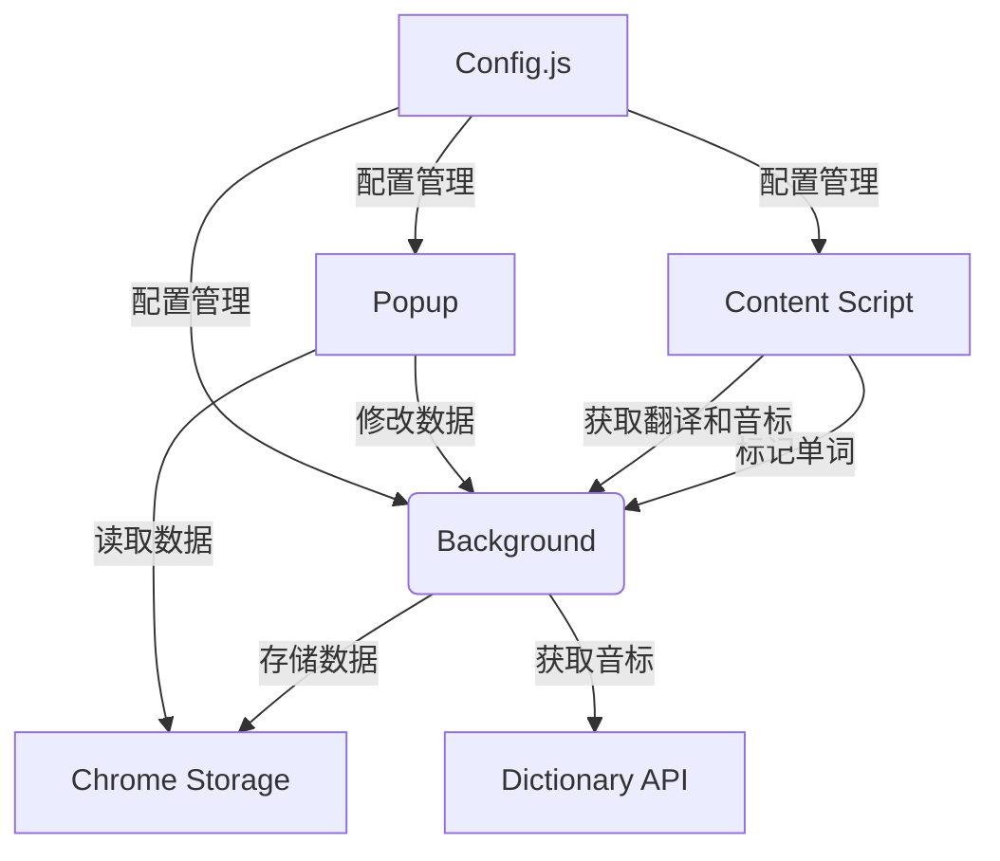

# Chrome 英语单词学习插件

## 功能概述
1. **智能单词标记**
   - 划选网页任意英文单词/词组自动添加蓝色下划线标记
   - 支持词组和多单词标记
   - 自动跳过前后空格
   - 300ms延迟确认机制，避免误操作
   - 支持ESC键取消标记

2. **实时翻译与音标**
   - 鼠标悬停标记显示现代化渐变弹窗
   - 先划线后翻译，提升用户体验
   - 显示"正在翻译..."临时提示
   - 划词时不再自动获取音标，提高划词速度
   - 可在单词本中手动为单个单词获取音标

3. **标记同步**
   - 标记一个单词，页面所有相同内容自动标记
   - 取消一个标记，页面所有相同标记自动移除
   - 单词本与标记同步更新

4. **单词本管理**
   - 查看所有已标记单词和词组
   - 编辑单词翻译和音标
   - 删除不需要的单词
   - 搜索单词功能（搜索框位于单词列表上方）
   - 自动记录添加/复习时间
   - 为单个单词手动获取音标（点击🔤按钮）

5. **数据持久化**
   - 页面刷新后自动恢复标记
   - 所有数据本地存储
   - 统一配置管理（API路径等）

6. **多端同步**
   - 支持单词本上传到云端
   - 支持从云端下载最新单词本
   - 基于时间戳的版本控制
   - 自动检查最新版本，避免重复更新
   - 支持多设备数据同步一致性

7. **域名排除功能**
   - 支持排除当前域名，插件将不再在此域名上运行
   - 可管理已排除的域名列表
   - 默认隐藏在高级配置中，减少视觉干扰

8. **现代化UI设计**
   - 全新的现代化UI设计，使用CSS变量统一管理样式
   - 响应式布局，适配不同屏幕尺寸
   - 可折叠的高级配置面板
   - 优化的单词卡片设计，提供更好的交互体验
   - 自定义滚动条，提升视觉效果

## 使用说明

### 安装与加载
1. 在Chrome地址栏输入：`chrome://extensions/`
2. 启用"开发者模式"
3. 点击"加载已解压的扩展程序"
4. 选择插件目录

### 基本使用
1. **标记单词**：在任意网页划选英文单词/词组
2. **查看翻译**：鼠标悬停标记单词（显示音标）
3. **管理单词本**：点击浏览器工具栏插件图标
   - 搜索：在单词列表上方的搜索框中输入关键词实时筛选
   - 编辑：点击单词卡片的✏️按钮（可更新音标）
   - 删除：点击单词卡片的🗑️按钮
   - 播放发音：点击单词卡片的🔊按钮

### 高级配置
1. **用户ID配置**：
   - 在顶部配置区输入11位数字ID（建议使用手机号）
   - 点击"保存"按钮保存配置
   - 点击"清除"按钮清除当前配置
   - 可在配置下方看到"用户ID必须为11位，建议使用手机号，多端同步时使用相同ID"的提示
   - 系统会自动验证用户ID是否为11位数字，不符合要求时会显示错误提示

2. **同步功能**：
   - 点击"⬇️ 拉取"从云端下载最新单词本
   - 点击"⬆️ 同步"将本地单词本上传到云端
   - 点击"🗑️ 删除"删除远程单词本

3. **域名排除功能**：
   - 点击"⚙️ 高级配置"展开高级选项
   - 查看当前域名
   - 点击"排除当前域名"将当前域名添加到排除列表
   - 在已排除域名列表中可点击×按钮移除排除
   - 排除后插件将不再在此域名上运行

### 高级功能
- **多设备同步**：使用相同的用户ID在不同设备上登录，可实现数据同步
- **API自动重试**：网络请求失败时自动重试，提高稳定性
- **性能优化**：优化了DOM操作和事件处理，减少性能消耗
- **扩展上下文错误处理**：添加了扩展上下文被销毁时的优雅处理，避免插件崩溃
- **边界检查和异常捕获**：全面的错误处理，提高插件稳定性

### 音标功能
- 可手动为单个单词获取音标（点击🔤按钮）
- 悬停时显示已保存的音标标注
- 支持手动更新音标信息

## 技术实现



### 核心文件
1. `manifest.json` - 插件配置
2. `config.js` - 统一配置管理（API路径、样式配置等）
3. `content.js` - 网页单词标记逻辑（支持词组和URL检测）
   - 实现300ms延迟确认机制，避免误操作
   - 支持ESC键取消标记
   - 优化的选区调整逻辑，简化代码结构
   - 使用requestAnimationFrame优化markOtherOccurrences方法，避免阻塞主线程
   - 添加防抖机制，避免频繁操作
   - 限制每个单词的最大标记数量为5个
   - 限制处理的文本节点数量为50个
4. `background.js` - 核心业务逻辑与存储
5. `popup/` - 单词本界面

## 配置选项

### 统一配置管理
所有配置项集中在`config.js`文件中，包括：
- API基础URL和端点
- 单词数量限制
- 样式配置（颜色、动画等）
- 存储键名
- TTS配置

### 配置项详情

#### API配置
```javascript
API_BASE_URL: 'http://chrome.yizhiweb.top:8080',
ENDPOINTS: {
  TRANSLATE: '/wx/chrome/crx/translate',
  PHONETICS: '/wx/chrome/crx/phonetics',
  SYNC_UPLOAD: '/wx/chrome/crx/sync/upload',
  SYNC_DOWNLOAD: '/wx/chrome/crx/sync/download',
  SYNC_DELETE: '/wx/chrome/crx/sync/delete'
}
```

#### 单词数量限制
```javascript
WORD_COUNT_LIMIT: 50, // 单次选中单词数量限制
MAX_MARKED_WORDS: 1000, // 最大标记单词数量
MAX_TEXT_NODES: 2000, // 最大处理文本节点数量
```

#### 样式配置
```javascript
STYLES: {
  MARK_COLOR: '#1e90ff',
  MARK_UNDERLINE_WIDTH: '2px',
  TOOLTIP_DELAY: 300
}
```

#### 存储键名
```javascript
STORAGE_KEYS: {
  DICTIONARY: 'word_dictionary',
  MARKS: 'word_marks',
  EXCLUDED_DOMAINS: 'excluded_domains' // 新增：域名排除列表
}
```

#### TTS配置
```javascript
TTS_RATE: 0.9,
TTS_LANG: 'en-US'
```

### 可自定义项
- `API_BASE_URL`：翻译和音标API地址
- `WORD_COUNT_LIMIT`：单次标记单词数量限制
- `MAX_MARKED_WORDS`：最大标记单词数量
- `MAX_TEXT_NODES`：最大处理文本节点数量
- `STYLES.MARK_COLOR`：标记下划线颜色
- `STYLES.TOOLTIP_DELAY`：提示框延迟时间
- `STYLES.MARK_UNDERLINE_WIDTH`：标记下划线宽度

## API 接口说明

### 后端 API 控制器
插件使用多个API接口，由Java Spring Boot后端提供：

#### 1. 翻译 API
- **URL**：`/chrome/crx/translate`
- **方法**：GET
- **参数**：
  - `word`：要翻译的英文单词或词组
- **请求示例**：
  ```
  GET /chrome/crx/translate?word=example
  ```
- **返回格式**：
  ```json
  {
    "text": "例子"
  }
  ```

#### 2. 音标 API
- **URL**：`/chrome/crx/phonetics`
- **方法**：GET
- **参数**：
  - `word`：要获取音标的英文单词
- **请求示例**：
  ```
  GET /chrome/crx/phonetics?word=example
  ```
- **返回格式**：
  ```json
  {
    "phoneticText": "/ɪɡˈzɑːmpl/",
    "audioUrl": "https://example.com/audio.mp3"
  }
  ```

#### 3. 单词本上传 API
- **URL**：`/chrome/crx/sync/upload`
- **方法**：POST
- **请求体**：
  ```json
  {
    "userId": "用户ID",
    "wordbook": [{"word": "example", "translation": "例子", "phonetics": "/ɪɡˈzɑːmpl/", "added": 1672531200000, "reviewed": 0}]
  }
  ```
- **返回格式**：
  ```json
  {
    "success": true,
    "message": "单词本上传成功",
    "filePath": "/home/static/file/user123_wordbook.json",
    "wordCount": 1,
    "timestamp": 1767692400000
  }
  ```

#### 4. 单词本下载 API
- **URL**：`/chrome/crx/sync/download`
- **方法**：GET
- **参数**：
  - `userId`：用户ID
- **请求示例**：
  ```
  GET /chrome/crx/sync/download?userId=user123
  ```
- **返回格式**：
  ```json
  {
    "success": true,
    "message": "单词本获取成功",
    "wordbook": [{"word": "example", "translation": "例子", "phonetics": "/ɪɡˈzɑːmpl/", "added": 1672531200000, "reviewed": 0}],
    "wordCount": 1,
    "timestamp": 1767692400000
  }
  ```

#### 5. 单词本删除 API
- **URL**：`/chrome/crx/sync/delete`
- **方法**：GET
- **参数**：
  - `userId`：用户ID
- **请求示例**：
  ```
  GET /chrome/crx/sync/delete?userId=user123
  ```
- **返回格式**：
  ```json
  {
    "success": true,
    "message": "单词本删除成功"
  }
  ```

#### 6. 同步用户列表 API
- **URL**：`/chrome/crx/sync/list`
- **方法**：GET
- **返回格式**：
  ```json
  {
    "success": true,
    "users": [{"userId": "user123", "fileName": "user123_wordbook.json", "fileSize": 200, "lastModified": 1767692400000}],
    "total": 1
  }
  ```

## 开发者说明

### 测试数据
```javascript
// 测试翻译API返回格式
{
  word: "example",
  translation: "例子",
  phonetic: "/ɪɡˈzɑːmpl/",
  added: 1672531200000,
  reviewed: 0
}
```

### 替换翻译API
修改`background.js`中的`handleTranslation`方法

## 版权信息
© 2026 英语学习插件开发团队