# Chrome 英语单词学习插件

## 功能概述

1. **单词标记与翻译**
   - 划选网页任意英文单词/词组自动添加蓝色下划线标记
   - 鼠标悬停标记显示翻译结果
   - 自动保存到单词本

2. **单词本管理**
   - 查看所有已标记单词
   - 编辑单词翻译
   - 删除不需要的单词
   - 搜索单词功能
   - 自动记录添加/复习时间

3. **数据持久化**
   - 页面刷新后自动恢复标记
   - 所有数据本地存储

## 使用说明

### 安装与加载
1. 在Chrome地址栏输入：`chrome://extensions/`
2. 启用"开发者模式"
3. 点击"加载已解压的扩展程序"
4. 选择插件目录

### 基本使用
1. **标记单词**：在任意网页划选英文单词
2. **查看翻译**：鼠标悬停标记单词
3. **管理单词本**：点击浏览器工具栏插件图标
   - 搜索：输入框实时筛选
   - 编辑：点击单词卡片的✏️按钮
   - 删除：点击单词卡片的🗑️按钮

## 技术实现

```mermaid
graph TD
    A[Content Script] -->|标记单词| B(Background)
    A -->|获取翻译| B
    B -->|存储数据| C[Chrome Storage]
    D[Popup] -->|读取数据| C
    D -->|修改数据| B
```



### 核心文件
1. `manifest.json` - 插件配置
2. `content.js` - 网页单词标记逻辑
3. `background.js` - 核心业务逻辑与存储
4. `popup/` - 单词本界面

## 配置选项

可在`manifest.json`中修改：
- 默认图标
- 权限设置
- 扩展行为

## 开发者说明

### 测试数据
```javascript
// 测试翻译API返回格式
{
  word: "example", 
  translation: "例子",
  added: 1672531200000,
  reviewed: 0
}
```

### 替换翻译API
修改`background.js`中的`handleTranslation`方法

## 版权信息
© 2023 英语学习插件开发团队