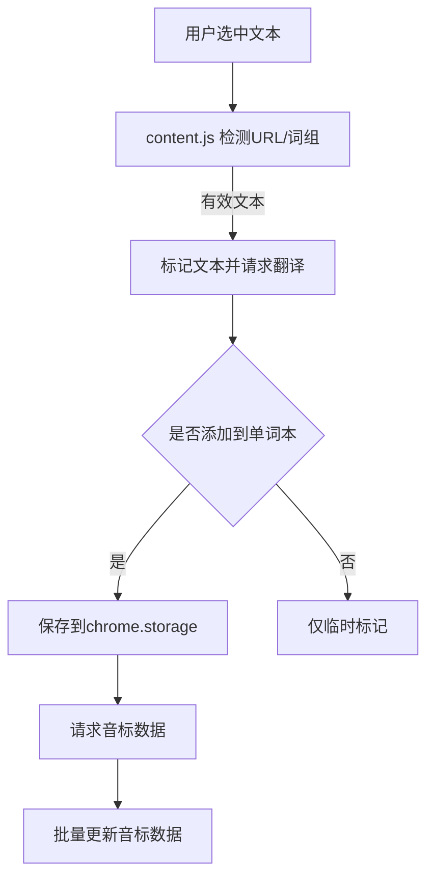

# 英语单词学习助手 Chrome 扩展 - 需求文档

## 1. 系统概述
- **目标**：帮助用户快速翻译、收藏和管理网页中的英文单词
- **技术栈**：Chrome扩展(Manifest V3)、DOM操作、语音合成API、音标API
- **主要功能**：
  - 划词翻译：下划线标记+悬浮翻译(含音标显示)
  - 单词本管理：添加/删除/编辑单词(支持词组)
  - 发音功能：单词发音支持(美式/英式)
  - 新增批量音标处理功能

## 2. 功能模块
### 2.1 内容脚本 (content.js)
- 划词选中识别(新增URL排除)
- 文本标记与样式管理
- 翻译和音标结果展示
- 点击交互(删除标记改进)

### 2.2 单词本 (popup.js)
- 单词列表展示(支持词组)
- 单词搜索过滤
- 编辑/删除功能
- 发音功能(TTS+API音频)
  
### 2.3 后台服务 (background.js)
- 新增批量音标获取功能
- 新增批量音标更新功能
- 数据同步优化

## 3. 数据流程

## 4. 技术规范
- **权限**：storage, activeTab, notifications
- **API端点**：
  - 音标资源: https://api.dictionaryapi.dev/api/v2/entries/en/
  - 词典API: https://60s.viki.moe/v2/fanyi
- **批量操作**：
  - 新增batchGetPhonetics方法
  - 新增batchUpdatePhonetics方法

## 5. 已知问题
- 已修复：下划线移除时翻译文本错误问题
- 已优化：URL文本检测功能
- 待改进：长词组音标获取成功率